### Theory

**1. Introduction to the history of Virtual Reality as mode of communication.**

The history of virtual reality (VR) is a fascinating journey through the realms of technology, innovation, and human imagination. It spans several decades, marked by key milestones and breakthroughs that have shaped the evolution of VR as we know it today. In 1965, computer scientist Ivan Sutherland introduced the concept of virtual reality with his groundbreaking work on the "Ultimate Display" at Harvard University. His paper, "The Ultimate Display," published in 1965, laid the theoretical groundwork for immersive virtual environments and interactive computer graphics [1]. Sutherland's vision became a reality in 1968 when he developed the first head-mounted display (HMD), known as the "Sword of Damocles." This device allowed users to experience basic virtual environments, laying the foundation for future VR technologies [2]. Throughout the 1980s and 1990s, VR gained momentum with the introduction of commercial VR systems by companies like SEGA and Nintendo. SEGA released the SEGA VR headset in the early 1990s, while Nintendo launched the Virtual Boy in 1995, albeit with limited success [3][4]. However, the early promise of VR was met with challenges, leading to a period known as the "Virtual Winter." Technological limitations, high costs, and a lack of compelling content contributed to a decline in public interest in VR during the late 1990s and early 2000s [5]. The turn of the millennium saw a resurgence of interest in VR, fueled by advancements in computing power, graphics technology, and user interfaces. Hollywood blockbusters like "The Matrix" (1999) brought the concept of virtual worlds to mainstream audiences, inspiring a new generation of VR enthusiasts [6].

In 2012, Palmer Luckey founded Oculus VR, a startup focused on developing affordable and high-quality VR hardware. Oculus Rift, the company's flagship VR headset, garnered widespread attention and acclaim, leading to Facebook's acquisition of Oculus VR in 2014 [7]. Since then, VR has continued to evolve, with major tech companies like HTC, Sony, and Microsoft investing in VR platforms and experiences. From immersive gaming and entertainment to applications in healthcare, education, and beyond, VR has become an integral part of our digital landscape, offering new possibilities for exploration, creativity, and collaboration [8].

**a) Stereoscopy:**

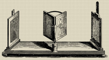

*Img. 1 Stereoscopy*

Stereoscopy involves creating an illusion of depth in images or films by presenting slightly offset images to each eye. In VR, stereoscopy contributes to the perception of depth and realism, enhancing the immersive experience by providing a sense of three-dimensionality.

**b) First Flight Simulator:**

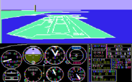

*Img. 2 First Flight Simulator*

The first flight simulator was created in the early 20th century to train pilots. These early simulators evolved over time and laid the foundation for modern VR technology by simulating real-world experiences in a controlled environment.

**c) Cinerama**

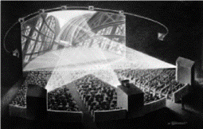

*Img. 3 Cinerama*

Cinerama was an early widescreen projection system used in filmmaking in the 1950s. It aimed to create an immersive viewing experience by employing multiple synchronized projectors onto a curved screen, giving audiences a wider field of view.

**d) Sensorama Simulator:**

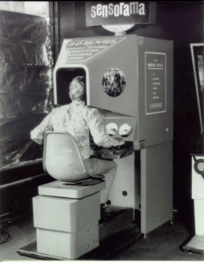

*Img. 4 Sensorama Simulator*

Sensorama was an early attempt at immersive multimedia in the 1960s. It offered a simulated experience through a cabinet-like device that combined stereoscopic 3D images, sound, vibration, and even smells to create a multisensory experience.

**e) Telesphere Mask:**

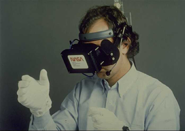

*Img. 5 Telesphere Mask*

The Telesphere Mask was an early head-mounted display developed in the 1960s. It aimed to immerse users in a virtual environment but was limited in capabilities compared to modern VR headsets.

**f) The Sword of Damocles - Head Mounted Display:**

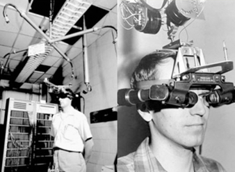

*Img. 6 The Sword of Damocles*

The Sword of Damocles was an early head-mounted display developed by Ivan Sutherland in the 1960s. It was a large, cumbersome device suspended from the ceiling, displaying rudimentary wireframe graphics and laying the groundwork for future HMD technology.

**g) LEEP Display:**

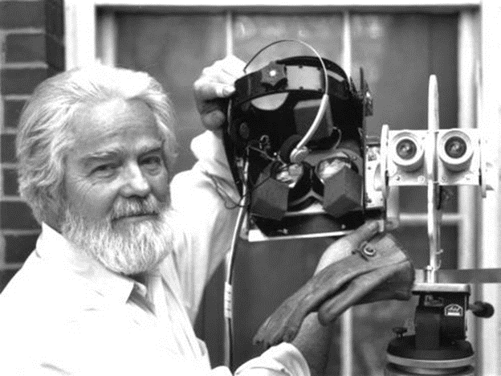

*Img. 7 LEEP Display*

The Large Expanse, Extra Perspective (LEEP) Display was developed in the 1980s and aimed to provide a wide field of view for VR experiences. It contributed to the advancement of immersive visual displays in virtual environments.

**h) Visual Programming Lab Research (VPL):**

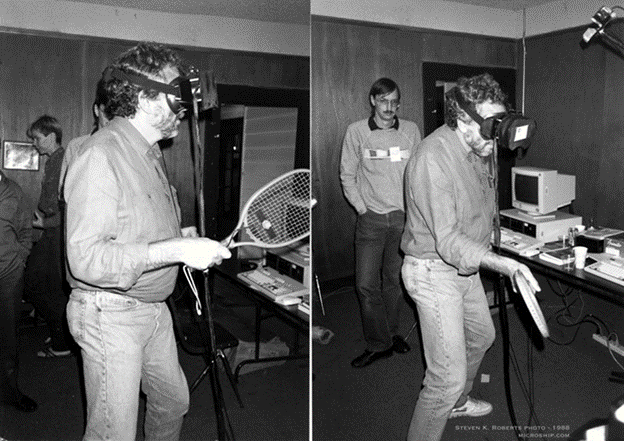

*Img. 8 VPL Research*

VPL Research was a pioneering company in the 1980s that contributed significantly to early virtual reality. They developed VR-related hardware, software, and devices, including data gloves and early VR systems.

**i) Virtuality Gaming System:**

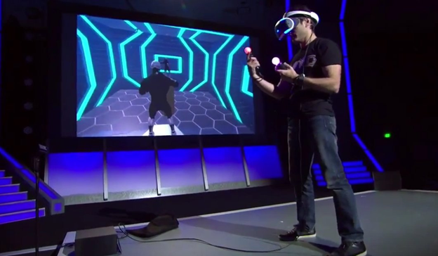

*Img. 9 Virtuality Gaming System*

Virtuality was a gaming system popular in the early 1990s, offering immersive VR experiences in arcades. It provided multiplayer gaming and interactive experiences using headsets and hand controllers.

**j) Cave Automatic Virtual Environment:**

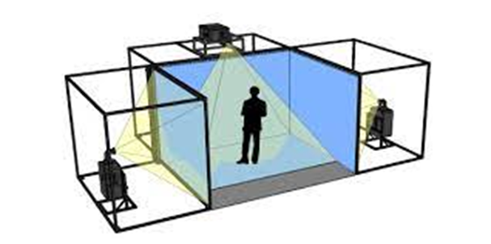

*Img. 10 Cave Automatic Virtual Environment*

The CAVE is a room-sized VR system comprising multiple walls onto which 3D graphics are projected, allowing users to interact and navigate within a virtual environment.

**k) SEGA VR Goggles & Nintendo Virtual Boy:**

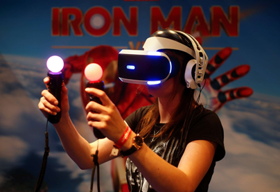

*Img. 11 SEGA VR Goggles & Nintendo Virtual Boy*

Both SEGA VR Goggles and Nintendo Virtual Boy were early attempts at consumer VR in the 1990s. While ambitious, they faced limitations in technology and were discontinued due to issues such as discomfort and poor visuals.

**l) Oculus Rift, Google Cardboard, HTC Vive:**

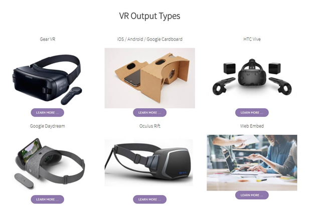

*Img. 12 Oculus Rift, Google Cardboard, HTC Vive*

These are modern VR headsets that revolutionized consumer VR. Oculus Rift, developed by Oculus VR (later acquired by Facebook), and HTC Vive offered high-quality, immersive VR experiences. Google Cardboard, on the other hand, aimed to make VR accessible using smartphones and a simple cardboard headset.

**m) 360 Video:**

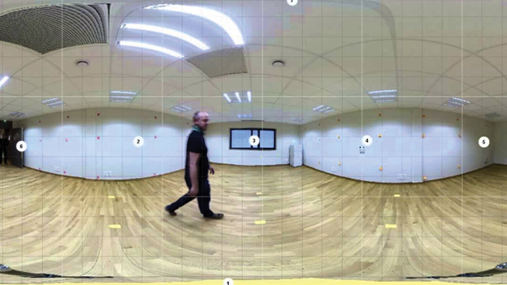

*Img. 13 360 Video*

360-degree videos capture footage in all directions, allowing viewers to explore the scene in any direction. They are commonly used in VR experiences, offering immersive storytelling and virtual exploration.

**n) Standalone VR Headsets:**

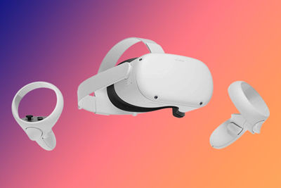

*Img. 14 Standalone VR Headsets*

Standalone VR headsets, like Oculus Quest, do not require a PC or external device for operation. They contain all the necessary hardware, making VR more accessible and portable.

**o) VR and Prospects:**

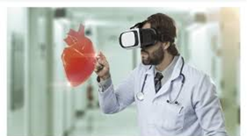

*Img. 15 VR and Prospects*

VR continues to evolve with advancements in technology, offering vast potential in various fields such as gaming, education, healthcare, training, and more. As technology improves, VR is becoming more immersive, affordable, and accessible to wider audiences, promising exciting prospects for its future applications and growth.
